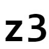
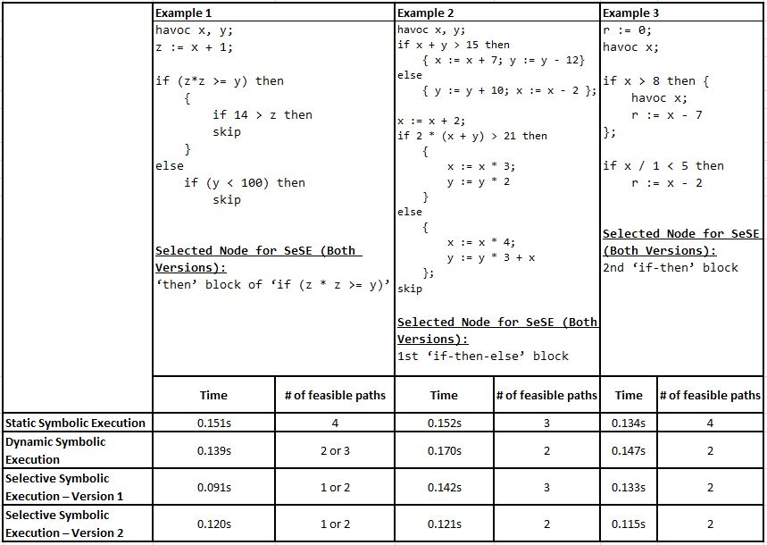

<!-- Reference:
https://github.com/othneildrew/Best-README-Template -->

<!-- PROJECT LOGO -->
 

  <h1><i>Explore SymEx</i></h1>

  
  
  .

  

    A Cohersive Package of four Symbolic Execution Engines !
  

 

<!-- TABLE OF CONTENTS -->

  
Table of Contents

  <ol>
    <li><a href="#about-the-project">About The Project</a></li>
    <li><a href="#built-with">Built With</a></li>
    <li><a href="#getting-started">Getting Started</a></li>
    <li><a href="#comparison-and-analysis-of-the-four-engines">Comparison and Analysis of the four Engines</a></li>
    <li><a href="#license-or-author">License or Author</a></li>
    <li><a href="#contact">Contact</a></li>
    <li><a href="#acknowledgments">Acknowledgments</a></li>
  </ol>

 

<!-- ABOUT THE PROJECT -->
## About The Project
  This is a software package that contains implementation for the following four execution engines:
  (Detailed report can be found in <b>'Report.pdf'</b> in the parent directory)

  * #### Static Symbolic Execution - (SSE)
      In SSE, the entire Control Flow Graph (CFG) is constructed with symbolic values. Hence, it ensures completeness and soundness, but may lead to path explosion.

  * #### Depth-first Dynamic Symbolic Execution (DSE)
    Symbolic Execution follows Concrete execution:
    1. Get or find concrete environment values.
    2. Concretely keep executing one of the branches, every time a branch condition is reached. Keep doing so, until either – both the branch conditions are infeasible (with concrete values) or until the leaf node has been reached.
    3. Check the last visited branch in memory.
    4. If the other branch condition involves any complex operations, then compute and replace them concretely in the branch condition. Also, concretize all variables involved in performing the complex operations.
    5. Symbolically check if Path-condition (PC) is SATISFIABLE, using an SMT solver.
    6. If PC is SATIFIABLE, then execute the node, else go to step (iii).
    7. Repeat from step (ii), until no more branches are left to be covered.
  
  * #### Selective Symbolic Execution - Variant 1 (SeSE-1)
    1. Take concrete input and module/part of interest from the developer/user.
    2. Run SeSE engine concretely till the module of interest has been encountered.
    3. Once module of interest is encountered, execute the rest of the program symbolically.

  * #### Selective Symbolic Execution - Variant 2 (SeSE-2)
    1. Take concrete input and module/part of interest from the developer/user.
    2. Run SeSE engine concretely till the module of interest has been encountered.
    3. Once module of interest is encountered, execute the entire module of interest symbolically.
    4. Once the module of interest has been fully traversed, execute the rest of the program concretely.
  
  
(<a href="#readme-top">back to top</a>)

## Built With
  &nbsp; &nbsp; &nbsp;  &nbsp; &nbsp; &nbsp; &nbsp; &nbsp; &nbsp; &nbsp;  &nbsp; &nbsp; &nbsp; &nbsp; &nbsp; &nbsp; 

  &nbsp; &nbsp; &nbsp; &nbsp; &nbsp; <b><i> Python </i></b> &nbsp; &nbsp; &nbsp; &nbsp; &nbsp; &nbsp; &nbsp; &nbsp; &nbsp; &nbsp; &nbsp; &nbsp; &nbsp; <b><i> TatSu </i></b> &nbsp; &nbsp; &nbsp; &nbsp; &nbsp; &nbsp; &nbsp; &nbsp; &nbsp; &nbsp; &nbsp; &nbsp; <b><i> z3 Solver </i></b>

  
(<a href="#readme-top">back to top</a>)

<!-- GETTING STARTED -->
## Getting Started
  #### Prerequisites
  * Python
  * TatSu, Coverage
  * z3 Solver (Microsoft)
  * Machine Requirements: Minimum 4GB RAM, Intel i5 Processor (or Equivalent)

  
  #### Setup & Use
  The program takes a WLang program as input and performs Verification on it.
  1. Create a file with WLang program.
  2. Run the respective engine in python with the path of file (from Part-1) as argument.

  ###### Following files contain the implementaion for respective engines:
  * Static Symbolic Execution:  <b>'wlang/SSE.py'</b>
  * Dynamic Symbolic Execution:  <b>'wlang/DSE.py'</b>
  * Selective Symbolic Execution - Variant-1 (SeSE-1):  <b>'wlang/SeSE_v1.py'</b>
  * Selective Symbolic Execution - Variant-2 (SeSE-2):  <b>'wlang/SeSE_v2.py'</b>

  
(<a href="#readme-top">back to top</a>)

<!-- Comparison and Analysis of the four Engines -->
## Comparison and Analysis of the four Engines
  * We tried VeriCross with a lot of test programs. The results of 3 such interesting test programs have been discussed below:

    

    * As expected, the time taken by Static Symbolic execution is the maximum of the lot. The freshly implemented techniques (DSE, SeSE-1, SeSE-2) in this project are faster than Static SE which was earlier implemented in Assignment 2.

    * But, its also quite abvious that we miss out on completeness with the new techniques. Each of DSE, SeSE-1, and SeSE-2 return a lower number of feasible paths than their static counterpart. Another very important aspect that we observe here is that each of the 3 new tehniques can potentially return different number of feasible paths, depending on thier initial concrete values. We had randomized our concrete input for the tests, and hence we see the varying results.

    * Also; time taken(SeSE-2) < time taken(SeSE-1) < time taken(DSE) in most cases; except for example-1, where we get SeSE-1 taking the lowest-time, but that may be due to the small size and structure of the program. The same condition holds for number of paths returned by these techniques; i.e.: #paths(SeSE-2) < #paths(SeSE-1) < #paths(DSE).

    * It maybe noted that for DSE, if we run the test cases, and print the feasible states; then we will observe that concrete branch also has a simplified value for the complex sub-expressions. This is essentially because, any symbolic path further down this branch may again need to be concretized to solve for these complex expressions and that too with the same concrete value that the symbolic path at previous branch was simplififed with (if any). Hence, instead of repeating this procedure, it makes sense to simplify the path for the concrete branch where it first observed that complex expression. This will hold for the concrete split going further and for symbolic split, since we would have had to essentially repeat the same procedure with the same concrete values again, this would also hold for it.

    ##### Conclusion
    * As we observed through our analysis, we can adopt different techniques of symbolic execution and also in different configurations to tackle the problems associated with Static or Classical symbolic execution, most particular being ’path explosion’ and ’complex operations’.
    
    * The symbolic execution techniques have been listed in the above figure in decreasing order of their association with symbolic activity. And hence we observe a lower time, required for symbolic processing, while the no. of feasible paths also decrease; from SSE to DSE to SeSE-1 to SeSE-2.
    
    * While SeSE may be the fastest techniques of the lot, they are not always practical in real-life. DSE is the most widely used technique, as it helps reduce path explosion and saves computing resources utilized by the solver; while also maintaining a relatively higher level of symbolic association.

    * Depending on the case and context, a developer or organization may choose to utilize any of these techniques or may even try and come up with thier own version of symbolic execution.
  
  * ##### The entire corpus of tested programs can be found in the following files:
    * 'wlang/test_sym.py'
    * 'wlang/test_DSE.py'
    * 'wlang/test_SeSE_v1.py'
    * 'wlang/test_SeSE_v2.py'
    * 'wlang/test_SSE_DSE_SeSE.py'
  
  
(<a href="#readme-top">back to top</a>)

<!-- LICENSE -->
## License or Author
  * <b>Authored by:</b> &nbsp; Uditya Laad, Karanjot Singh - University of Waterloo
  * <b>WLang Structure</b> - &nbsp; Provided by Prof. Arie Gurfinkel, University of Waterloo, Waterloo, ON, CA

  
(<a href="#readme-top">back to top</a>)

<!-- CONTACT -->
## Contact
  <b>Uditya Laad</b> &nbsp; [@linkedin.com/in/uditya-laad-222680148](https://www.linkedin.com/in/uditya-laad-222680148/)
   
  &nbsp; &nbsp; &nbsp; &nbsp; &nbsp; &nbsp; &nbsp; &nbsp; &nbsp; &nbsp; &nbsp; [@github.com/udityalaad](https://github.com/udityalaad)
  
  &nbsp; &nbsp; &nbsp; &nbsp; &nbsp; &nbsp; &nbsp; &nbsp; &nbsp; &nbsp; &nbsp; udityalaad123@gmail.com

  <b>Project Link</b> &nbsp; [https://github.com/udityalaad/Explore_SymEx](https://github.com/udityalaad/Explore_SymEx)

  
(<a href="#readme-top">back to top</a>)

<!-- ACKNOWLEDGMENTS -->
## Acknowledgments
  * ECE 653 - Assignment 2, Prof. Arie Gurfinkel, Prof. Patrick Lam - University of Waterloo, Waterloo, ON, CA
  * [Yu LIU*, Xu ZHOUa and Wei-Wei GONGb.: A Survey of Search Strategies in the Dynamic Symbolic Execution](https://www.itm-conferences.org/articles/itmconf/abs/2017/04/itmconf_ita2017_03025/itmconf_ita2017_03025.html)
  * [ROBERTO BALDONI, EMILIO COPPA, DANIELE CONO D’ELIA, CAMIL DEMETRESCU, and IRENE FINOCCHI, Sapienza University of Rome.: A Survey of Symbolic Execution Techniques](https://arxiv.org/abs/1610.00502)
  * [Vitaly Chipounov, Vlad Georgescu, Cristian Zamfir, George Candea School of Computer and Communication Sciences ´E cole Polytechnique F´ed´erale de Lausanne (EPFL), Switzerland.: Selective Symbolic Execution](https://infoscience.epfl.ch/record/139393)
  * [Tutorials Point, Software testing dictionary](https://www.tutorialspoint.com/software_testing_dictionary/symbolic_execution.htm)
  * [Wikipedia, Symbolic Execution](https://en.wikipedia.org/wiki/Symbolic_execution)
  * [Microsoft Research, z3](https://www.microsoft.com/en-us/research/project/z3-3/)
  * [University of Waterloo, ECE 653, Symbolic Execution](https://git.uwaterloo.ca/stqam-1225/pdfs/-/raw/master/W05-SymExec.pdf)
  * [Patrice Godefroid Nils Klarlund, Koushik Sen.: DART: Directed Automated Random Testing](https://web.eecs.umich.edu/~weimerw/590/reading/p213-godefroid.pdf)
  * [Koushik Sen, Darko Marinov, Gul Agha.: CUTE: A Concolic Unit Testing Engine for C](https://mir.cs.illinois.edu/marinov/publications/SenETAL05CUTE.pdf)
  * [Cristian Cadar, Vijay Ganesh, Peter M. Pawlowski, David L. Dill, Dawson R. Engler.: EXE: Automatically Generating Inputs of Death](https://dl.acm.org/doi/10.1145/1455518.1455522)
  * [KLEE, Github IO](https://klee.github.io/)
  * [University of Waterloo, ECE 653, Dynamic Symbolic Execution](https://git.uwaterloo.ca/stqam-1225/pdfs/-/raw/master/W06-DSE.pdf)
  * [Patrice Godefroid, Michael Y. Levin, David Molnar, Microsoft.: SAGE: Whitebox Fuzzing for Security Testing](https://queue.acm.org/detail.cfm?id=2094081)
  * [Kin-Keung Ma, Khoo Yit Phang, Jeffrey S. Foster, and Michael Hicks: Directed symbolic execution](https://www.cs.umd.edu/~mwh/papers/dse-sas11.pdf)
  * Majumdar, Rupak, and Koushik Sen. ”Hybrid concolic testing.” 29th International Conference on Software Engineering (ICSE’07). IEEE, 2007.
  * [Peter Dinges and Gul Agha. 2014. Targeted test input generation using symbolic-concrete backward execution. In Proceedings of the 29th ACM/IEEE International Conference on Automated Software Engineering (ASE’14). 31–36. DOI](http://dx.doi.org/10.1145/2642937.2642951)

  
(<a href="#readme-top">back to top</a>)

